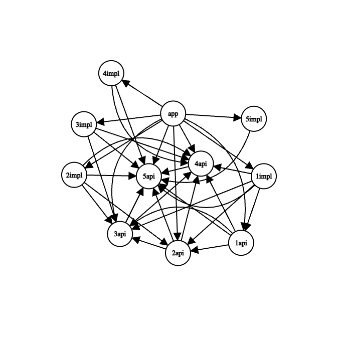

# Структура модулей

## Вариант 1

Худший вариант, при котором наибольшая взаимосвязь между модулями.

Количество модулей: 6`*`  
Глубина зависимостей: 5 `application -> library01 -> library02 -> library03 -> library04 -> library05`  
Связей между модулями: 15

`*` без учёта модуля `source`.



Зависимости:
```
+--- project :application
     +--- project :sources:library01
     +--- project :sources:library02
     +--- project :sources:library03
     +--- project :sources:library04
     \--- project :sources:library05
```
```
+--- project :sources:library01
     +--- project :sources:library02
     +--- project :sources:library03
     +--- project :sources:library04
     \--- project :sources:library05
```
```
+--- project :sources:library02
     +--- project :sources:library03
     +--- project :sources:library04
     \--- project :sources:library05
```
```
+--- project :sources:library03
     +--- project :sources:library04
     \--- project :sources:library05
```
```
+--- project :sources:library04
     \--- project :sources:library05
```
```
+--- project :sources:library05
```
