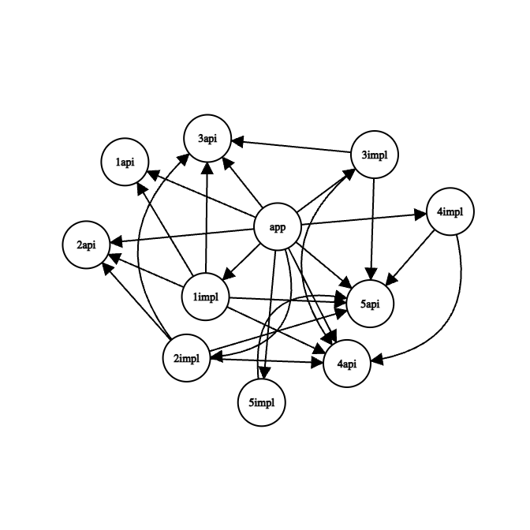

# Структура модулей

## Вариант 3

Второй вариант с разделением на `api/impl`, где запрещено `api` зависеть от `api`.
Особенность данного варианта в том, что максимальная глубина зависимостей всегда будет **2**.

Количество модулей: 11`*`  
Глубина зависимостей: 2 `application -> library01:impl -> library01:api`  
Связей между модулями: 25

`*` без учёта модулей `source/library`.



Зависимости:
```
+--- project :application
     +--- project :sources:library01:api
     +--- project :sources:library01:impl
     +--- project :sources:library02:api
     +--- project :sources:library02:impl
     +--- project :sources:library03:api
     +--- project :sources:library03:impl
     +--- project :sources:library04:api
     +--- project :sources:library04:impl
     +--- project :sources:library05:api
     \--- project :sources:library05:impl
```
```
+--- project :sources:library01:impl
     +--- project :sources:library01:api
     +--- project :sources:library02:api
     +--- project :sources:library03:api
     +--- project :sources:library04:api
     \--- project :sources:library05:api
```
```
+--- project :sources:library01:api
```
```
+--- project :sources:library02:impl
     +--- project :sources:library02:api
     +--- project :sources:library03:api
     +--- project :sources:library04:api
     \--- project :sources:library05:api
```
```
+--- project :sources:library02:api
```
```
+--- project :sources:library03:impl
     +--- project :sources:library03:api
     +--- project :sources:library04:api
     \--- project :sources:library05:api
```
```
+--- project :sources:library03:api
```
```
+--- project :sources:library04:impl
     +--- project :sources:library04:api
     \--- project :sources:library05:api
```
```
+--- project :sources:library04:api
```
```
+--- project :sources:library05:impl
     \--- project :sources:library05:api
```
```
+--- project :sources:library05:api
```
